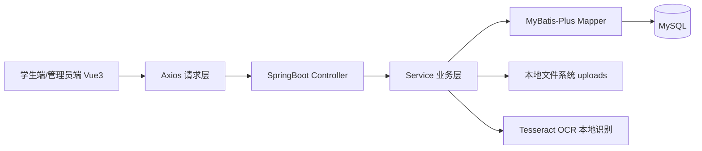
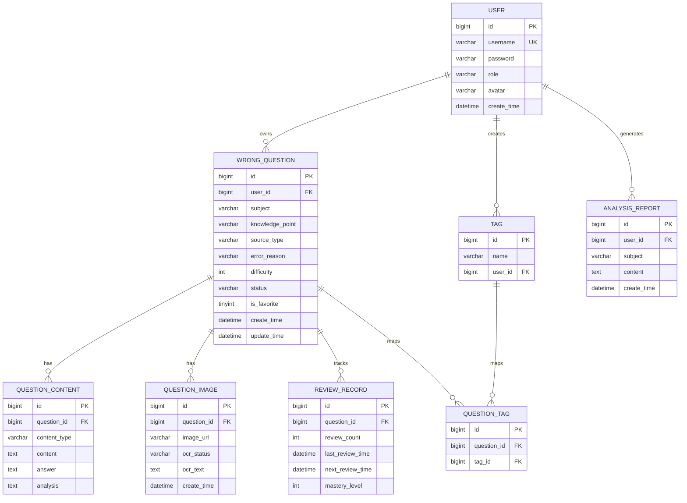

# 基于 SpringBoot + Vue 的智能错题本系统技术说明文档（完整版）

> 适用项目：`D:/Java_project/mistake_notebook`
> 
> 文档用途：论文撰写、答辩讲解、后期维护、ER 图绘制参考
> 
> 版本日期：2026-02-19

---

## 1. 总体功能说明

本系统以“错题采集 → 错题管理 → 智能复习 → 学情分析”为主线，面向 **学生端学习闭环** 与 **管理员端系统评估视角** 两类用户。

### 1.1 学生端功能

#### （1）用户管理模块
- 注册/登录：`/api/user/register`、`/api/user/login`
- JWT 身份认证：后端签发 token，前端在 `Authorization` 头中携带
- 个人信息查询/修改：`/api/user/info`、`/api/user/update`
- 学生角色访问控制：控制器中通过 `AuthUtil.requireStudentUserId` 进行角色校验

#### （2）错题采集模块
- 手动录入：保存 `wrong_question + question_content + question_tag`
- 图片上传与 OCR：上传图片后写入 `question_image`，OCR 文本写入 `question_content`
- 多标签管理：支持“已有 tag 绑定”与“新 tag 自动创建”
- OCR 模式：支持 `off / mock / tesseract`，当前默认 `tesseract`，失败自动回退 mock

#### （3）错题管理模块
- 按科目/知识点查询：支持条件筛选
- 多维筛选：状态、难度、收藏、关键词、时间范围
- 编辑与删除：更新基础信息、内容、标签；支持删除错题
- 收藏功能：单题收藏开关

#### （4）智能复习模块
- 按艾宾浩斯间隔生成复习节奏（1,2,4,7,15,30 天）
- 今日待复习提醒：返回 `dueNowCount`、`dueTodayCount`、`overdueCount`、`dueLaterTodayCount`、下次复习时间
- 错题重做与解析查看：获取题干、答案、解析、标签
- 掌握状态动态更新：提交复习结果后更新 `review_record` 与 `wrong_question.status`

#### （5）学情分析模块（学生视角）
- 各科错题数量统计
- 错误原因分布分析
- 知识点薄弱项识别（TopN）
- 学情分析文本报告自动生成并落库 `analysis_report`
- 页面图表化展示（进度条/柱状视觉）

---

### 1.2 管理员端功能

#### （1）管理员登录与认证
- 与普通登录复用同一接口 `/api/user/login`
- 通过 JWT 中 `role=admin` 判定管理员身份
- 前端路由守卫限制管理员访问 `/admin`

#### （2）学生学情查看
- 学生列表浏览：显示错题数、掌握率、高频错误知识点
- 单个学生概览：错题数量、掌握率、科目分布、错误原因、知识点统计

#### （3）系统级统计分析
- 各学科错题数量统计
- 错误原因分布统计
- 知识点错误集中度分析（TopN）
- 用于系统学习效果评估，不涉及教学管理干预

---

## 2. 总体结构说明（含分层作用）

## 2.1 技术栈

### 后端
- 框架：Spring Boot 3.x
- 持久层：MyBatis-Plus
- 认证：JWT（`java-jwt`）
- 安全：Spring Security（当前全放行，业务层手动鉴权）
- 数据库：MySQL 8.0

### 前端
- 框架：Vue 3（Composition API）
- 路由：Vue Router 4
- UI：Element Plus
- 请求：Axios
- 构建：Vite

---

## 2.2 系统架构图（论文可直接引用）

---

## 2.3 后端分层结构与职责

后端根包：`com.wsy.mistake_notebook`

- `config`：基础配置层
  - CORS、Security、静态资源映射、管理员初始化、模块配置
- `controller`：接口控制层
  - 接收请求、参数绑定、调用服务、返回统一结果
- `dto`：请求参数对象
  - 只承载入参，不承载业务行为
- `entity`：数据库实体映射
  - 与表结构一一对应（MyBatis-Plus）
- `mapper`：数据访问层
  - 继承 `BaseMapper<T>`，执行 CRUD
- `service`：业务接口层
  - 定义业务边界与能力
- `service.impl`：业务实现层
  - 编排流程、校验权限、事务控制、聚合统计
- `utils`：工具层
  - JWT 解析、鉴权抽取
- `vo`：响应对象
  - 面向前端的输出结构
- `exception`：全局异常处理
  - 把异常转换为统一 `Result.fail`

---

## 2.4 前端结构与职责

前端根目录：`front/src`

- `main.js`：Vue 应用入口，注册路由与 Element Plus
- `App.vue`：应用根视图（`<router-view />`）
- `router/index.js`：路由定义 + 路由守卫（登录/角色控制）
- `utils/request.js`：Axios 实例、请求与响应拦截器
- `api/*.js`：按业务划分 API 函数
- `layouts/*.vue`：学生端/管理员端壳布局
- `views/**`：页面实现（登录、学生页面、管理员看板）
- `style.css`：全局主题与基础样式

---

## 3. 每个文件详细技术说明与逻辑思路

> 说明策略：核心业务文件详细解释；样板/简单文件给出职责与用途。论文可按“职责-输入-处理-输出”结构展开。

## 3.1 后端文件说明

### 3.1.1 启动文件

#### `back/src/main/java/com/wsy/mistake_notebook/MistakeNotebookApplication.java`
- 作用：Spring Boot 启动入口
- 核心逻辑：`SpringApplication.run(...)`
- 论文可写点：系统采用单体架构，启动后统一暴露 API 与静态资源

---

### 3.1.2 config 层

#### `config/CorsConfig.java`
- 作用：跨域配置
- 核心逻辑：允许前端开发地址 `http://localhost:5173`
- 说明：允许常见 HTTP 方法，允许 `Authorization` 头

#### `config/SecurityConfig.java`
- 作用：Security 基础配置 + 密码加密器
- 核心逻辑：
  - 注册 `BCryptPasswordEncoder`
  - 关闭 CSRF，开启 CORS，当前 `anyRequest().permitAll()`
- 设计说明：鉴权实际在控制器/工具类中做 token+role 校验

#### `config/UploadResourceConfig.java`
- 作用：把本地上传目录映射为可访问资源
- 核心逻辑：`/uploads/** -> file:/absolute_upload_dir`
- 价值：前端可直接预览上传图片 URL

#### `config/MistakeModuleProperties.java`
- 作用：读取 `mistake.*` 配置
- 配置项：
  - `mistake.upload-dir`
  - `mistake.ocr.mode`（off/mock/tesseract）
  - `mistake.ocr.tesseract-cmd`
  - `mistake.ocr.lang`

#### `config/InitAdminConfig.java`
- 作用：系统启动时初始化管理员账号
- 核心逻辑：
  - 若 `admin` 不存在则创建
  - 若 admin 密码是明文则重置为 BCrypt 后的 `admin123`
  - 若角色错误则修正为 `admin`
- 价值：避免“数据库明文密码导致登录失败”

#### `config/JwtInterceptor.java`
- 作用：预留拦截器（当前为空实现）
- 论文写法：项目当前采用“控制器内鉴权”策略，拦截器作为可扩展点

---

### 3.1.3 controller 层

#### `controller/UserController.java`
- 基础路由：`/api/user`
- 接口：
  - `POST /register` 注册
  - `POST /login` 登录，返回 JWT
  - `GET /info` 根据 token 返回用户信息
  - `PUT /update` 更新用户信息
- 逻辑思路：登录成功后前端据 `role` 跳转学生端或管理员端

#### `controller/TagController.java`
- 基础路由：`/api/student/tags`
- 鉴权：`AuthUtil.requireStudentUserId`
- 接口：标签列表、新增、删除

#### `controller/WrongQuestionController.java`
- 基础路由：`/api/student/questions`
- 核心职责：错题 CRUD、筛选查询、收藏、标签更新、图片录入
- 特色逻辑：
  - 图片上传后将相对地址转换为绝对 URL 返回
  - 多条件查询与分页返回

#### `controller/ReviewController.java`
- 基础路由：`/api/student/review`
- 接口：今日摘要、待复习列表、下一题、题目详情、提交复习
- 核心价值：把复习闭环完整串起

#### `controller/AnalysisController.java`
- 基础路由：`/analysis/student`
- 接口：
  - `GET /overview` 学生首页统计
  - `GET /dashboard` 学情图表+报告数据

#### `controller/AdminAnalysisController.java`
- 基础路由：`/api/admin/analysis`
- 鉴权：`AuthUtil.requireAdminUserId`
- 接口：
  - `GET /students` 学生列表概览
  - `GET /students/{studentId}/overview` 单学生学情
  - `GET /system` 系统统计

---

### 3.1.4 dto 层（请求对象）

#### 用户相关
- `dto/LoginDTO.java`：`username/password`
- `dto/RegisterDTO.java`：`username/password`

#### 标签相关
- `dto/TagCreateDTO.java`：`name`
- `dto/QuestionTagsUpdateDTO.java`：`tagIds/tagNames`

#### 错题相关
- `dto/ManualWrongQuestionCreateDTO.java`
  - 含学科/知识点/错因/难度/收藏 + 题干/答案/解析 + 标签
- `dto/ImageWrongQuestionCreateDTO.java`
  - 含学科/知识点/错因/难度/收藏 + 标签（图片内容走上传文件）
- `dto/WrongQuestionUpdateDTO.java`
  - 支持编辑错题元数据、内容、标签
- `dto/WrongQuestionQueryDTO.java`
  - 支持分页 + 科目/知识点/状态/难度/收藏/关键词/时间范围筛选

#### 复习相关
- `dto/ReviewSubmitDTO.java`
  - `correct` 是否答对
  - `redoAnswer` 重做答案（用于记录作答）

---

### 3.1.5 entity 层（数据库映射）

#### `entity/User.java`
- 对应 `user` 表：账号、密码、角色、头像、创建时间

#### `entity/Tag.java`
- 对应 `tag` 表：`name + user_id` 唯一约束

#### `entity/WrongQuestion.java`
- 对应 `wrong_question`：错题主记录
- 字段：用户、科目、知识点、来源类型、错因、难度、状态、收藏、时间

#### `entity/QuestionContent.java`
- 对应 `question_content`：题干/答案/解析
- `content_type` 标识来自手动录入还是 OCR

#### `entity/QuestionImage.java`
- 对应 `question_image`：图片地址 + OCR 状态 + OCR 文本

#### `entity/QuestionTag.java`
- 对应 `question_tag`：错题与标签多对多中间表

#### `entity/ReviewRecord.java`
- 对应 `review_record`：复习次数、掌握等级、下次复习时间

#### `entity/AnalysisReport.java`
- 对应 `analysis_report`：学生学情分析报告存档

---

### 3.1.6 mapper 层

以下文件均继承 `BaseMapper<T>`，负责实体 CRUD：

- `mapper/UserMapper.java`
- `mapper/TagMapper.java`
- `mapper/WrongQuestionMapper.java`
- `mapper/QuestionContentMapper.java`
- `mapper/QuestionImageMapper.java`
- `mapper/QuestionTagMapper.java`
- `mapper/ReviewRecordMapper.java`
- `mapper/AnalysisReportMapper.java`

论文写法：Mapper 作为数据访问抽象层，将 SQL 复杂性屏蔽在服务层之外。

---

### 3.1.7 service 接口层

- `service/UserService.java`：用户注册、登录、查询、更新
- `service/TagService.java`：标签列表、新建、删除
- `service/WrongQuestionService.java`：错题采集/管理完整能力
- `service/ReviewService.java`：复习计划与提交能力
- `service/AnalysisService.java`：学生学情统计能力
- `service/AdminAnalysisService.java`：管理员学情/系统统计能力

---

### 3.1.8 service.impl 实现层（核心业务）

#### `service/impl/UserServiceImpl.java`
- 注册：用户名查重 + BCrypt 加密
- 登录：用户名查询 + `passwordEncoder.matches` + JWT 签发
- 论文点：认证与密码安全（不可逆哈希）

#### `service/impl/TagServiceImpl.java`
- 标签按用户隔离
- 创建时做名称非空与唯一性处理
- 删除时仅允许删除本人标签

#### `service/impl/WrongQuestionServiceImpl.java`
- 业务核心之一：
  1. 手动错题录入流程
  2. 图片错题录入流程（上传 + OCR + 内容入库）
  3. 错题列表多条件查询 + 分页
  4. 错题详情聚合（主表+内容+图片+标签）
  5. 编辑、删除、收藏、标签重绑定
- OCR 逻辑说明：
  - `mode=off`：返回 `pending`
  - `mode=tesseract`：调用本地命令识别，成功返回 `success`
  - 识别失败：自动回退 mock，返回 `failed` 并附失败原因
  - 成功文本标明“本地识别可能存在误差”

#### `service/impl/ReviewServiceImpl.java`
- 业务核心之二（智能复习）：
  - 自动补齐用户题目对应的 `review_record`
  - 统一时间口径：
    - 当前待复习：`next_review_time <= 当前时刻`（包含逾期）
    - 今日计划：`今日00:00 <= next_review_time <= 今日23:59`（不含逾期）
    - 逾期未复习：`next_review_time < 今日00:00` 或 `next_review_time is null`
    - 今日稍后任务：`当前时刻 < next_review_time <= 今日23:59`
  - 提供分层接口：
    - `GET /api/student/review/due-now`：当前待复习列表
    - `GET /api/student/review/today-plan`：今日计划列表
    - `GET /api/student/review/due`：兼容旧路由（等价 `due-now`）
  - 按复习结果更新 `review_count/mastery_level/next_review_time/status`
  - 间隔策略：`[1,2,4,7,15,30]` 天

#### `service/impl/AnalysisServiceImpl.java`
- 学生分析核心：
  - 总量/掌握率统计
  - 科目分布、错因分布、薄弱知识点 TopN
  - 文本报告自动生成 + 存档到 `analysis_report`

#### `service/impl/AdminAnalysisServiceImpl.java`
- 管理员分析核心：
  - 学生列表概览（错题数、掌握率、高频知识点）
  - 单学生详细分布
  - 系统级分布统计（科目/错因/知识点集中度）

---

### 3.1.9 utils 工具层

#### `utils/JwtUtil.java`
- JWT 生成/校验/提取 `userId` `role`
- token 过期时间：24 小时

#### `utils/AuthUtil.java`
- 从请求头提取 token（支持 `Authorization` 或 `token`）
- `requireStudentUserId`：校验学生权限
- `requireAdminUserId`：校验管理员权限

---

### 3.1.10 vo 输出层

- `vo/Result.java`：统一响应体（`code/message/data`）
- `vo/QuestionTagVO.java`：标签输出对象
- `vo/WrongQuestionManageVO.java`：错题管理列表/详情输出
- `vo/ReviewQuestionVO.java`：复习题目聚合输出
- `vo/ReviewTodaySummaryVO.java`：复习首页摘要输出（当前待复习、今日计划、逾期、今日稍后、预览列表）

---

### 3.1.11 exception 层

#### `exception/GlobalExceptionHandler.java`
- 捕获异常并统一转为 `Result.fail`
- 论文可写点：统一异常出口，前后端错误处理一致性

---

## 3.2 前端文件说明

### 3.2.1 入口与基础

#### `front/src/main.js`
- 注册 Vue 应用、路由、Element Plus

#### `front/src/App.vue`
- 根组件，仅承载路由视图

#### `front/src/style.css`
- 全局主题变量、通用组件视觉规范、滚动条与过渡样式

---

### 3.2.2 路由与请求

#### `front/src/router/index.js`
- 路由定义：
  - `/login`
  - `/student/*`（学生布局）
  - `/admin`（管理员布局）
- 路由守卫：
  - 未登录跳转登录页
  - 解析 role 控制学生/管理员访问路径

#### `front/src/utils/request.js`
- Axios 实例 `baseURL=http://localhost:8080`
- 请求拦截：自动附加 `Authorization: Bearer token`
- 响应拦截：401 自动清理本地登录态并跳转

---

### 3.2.3 API 封装层

#### `api/user.js`
- `register/login/getInfo/updateUser`
- 注意：该文件自身 `baseURL` 为 `http://localhost:8080/api`（与 request.js 不同）

#### `api/tag.js`
- 标签增删查

#### `api/question.js`
- 错题手动/图片新增、查询、详情、更新、删除、收藏、科目/知识点列表

#### `api/review.js`
- 复习摘要、待复习列表、下一题、题目详情、提交作答

#### `api/analysis.js`
- 学生学情分析看板接口

#### `api/admin.js`
- 管理员学生列表、单学生概览、系统统计

---

### 3.2.4 布局层

#### `layouts/StudentLayout.vue`
- 学生端整体壳：侧边菜单 + 顶部栏 + 内容区
- 负责显示用户名、退出登录、页面标题映射

#### `layouts/AdminLayout.vue`
- 管理员端壳：管理员专属菜单与顶部信息

---

### 3.2.5 页面层（views）

#### `views/Login.vue`
- 登录/注册一体化页面
- 登录成功后根据 `role` 跳转 `/student` 或 `/admin`

#### `views/student/Dashboard.vue`
- 学生首页：欢迎区、统计卡片、复习提醒、快捷入口
- 请求：`/analysis/student/overview` + `review summary`

#### `views/student/AddQuestion.vue`
- 错题采集页：手动录入 + 图片上传
- 支持标签选择、新标签创建、上传预览

#### `views/student/QuestionManage.vue`
- 错题管理页：
  - 多维筛选
  - 表格浏览
  - 编辑抽屉
  - 删除/收藏

#### `views/student/Review.vue`
- 智能复习页：待复习题展示、重做提交、解析查看
- 展示掌握相关状态变化

#### `views/student/TagManage.vue`
- 标签管理页：列表、新增、删除

#### `views/student/Analysis.vue`
- 学生学情分析页：
  - 科目统计
  - 错因分布
  - 薄弱知识点 TopN
  - 文本报告展示

#### `views/admin/Dashboard.vue`
- 管理员看板：
  - 学生列表浏览
  - 单学生概览
  - 系统级统计（三块图表）

---

### 3.2.6 其他文件

#### `components/HelloWorld.vue`
- Vite 模板残留文件（非业务核心）

#### `assets/vue.svg`
- 模板资源（非业务核心）

---

## 4. 数据库结构设计说明（ER 图参考）

> 依据当前 SQL 结构（MySQL 8）

## 4.1 表设计清单

1. `user`：用户主表（学生/管理员）
2. `wrong_question`：错题主表
3. `question_content`：题目内容表（题干/答案/解析）
4. `question_image`：图片与 OCR 结果表
5. `tag`：用户标签表
6. `question_tag`：错题-标签中间表
7. `review_record`：复习进度表
8. `analysis_report`：学情分析报告表

---

## 4.2 主键、外键与约束说明

### `user`
- PK：`id`
- UK：`username`
- 角色：`role in {student, admin}`（逻辑约束）

### `wrong_question`
- PK：`id`
- FK：`user_id -> user.id`
- 索引：`idx_user(user_id)`、`idx_subject(subject)`

### `question_content`
- PK：`id`
- FK：`question_id -> wrong_question.id`

### `question_image`
- PK：`id`
- FK：`question_id -> wrong_question.id`

### `tag`
- PK：`id`
- FK：`user_id -> user.id`
- UK：`uk_tag_user(name, user_id)`

### `question_tag`
- PK：`id`
- FK：`question_id -> wrong_question.id`
- FK：`tag_id -> tag.id`
- UK：`uk_question_tag(question_id, tag_id)`

### `review_record`
- PK：`id`
- FK：`question_id -> wrong_question.id`

### `analysis_report`
- PK：`id`
- FK：`user_id -> user.id`
- 索引：`idx_user_subject(user_id, subject)`

---

## 4.3 关系基数（用于 ER 图）

- `user (1) —— (N) wrong_question`
- `wrong_question (1) —— (N) question_content`
- `wrong_question (1) —— (N) question_image`
- `user (1) —— (N) tag`
- `wrong_question (N) —— (N) tag` 通过 `question_tag`
- `wrong_question (1) —— (N) review_record`
- `user (1) —— (N) analysis_report`

---

## 4.4 ER 图（Mermaid，可直接复制绘制）

---

## 4.5 数据库设计合理性（论文可写）

- 主从拆分思想：错题主信息与扩展信息（内容、图片、标签、复习记录）分表，便于扩展
- 通过中间表实现标签多对多，满足灵活标注需求
- 关键唯一约束保证数据一致性（用户名唯一、同用户标签名唯一、同题同标签唯一）
- 使用外键保证引用完整性，删除主记录自动级联删除关联数据

---

## 5. 关键业务流程说明（论文流程图素材）

## 5.1 登录与角色分流
1. 前端提交用户名密码到 `/api/user/login`
2. 后端校验 BCrypt 密码并签发 JWT（含 `userId+role`）
3. 前端持久化 token
4. 拉取 `/api/user/info` 获得 role
5. role=admin 跳 `/admin`，否则跳 `/student`

## 5.2 图片错题采集 + OCR
1. 上传图片 + 元信息
2. 创建 `wrong_question` 主记录
3. 保存图片文件到本地 `uploads`
4. 执行 OCR：
   - tesseract 成功：写入真实文本
   - tesseract 失败：回退 mock，并标注失败原因
5. 写入 `question_image` 与 `question_content`
6. 绑定标签关系

## 5.3 智能复习提交
1. 系统先按用户题目自动补齐 `review_record`（保证每题可调度）
2. 生成复习汇总：
   - 当前待复习数（到期 + 逾期）
   - 今日计划总量（仅今天时间窗）
   - 逾期数、今日稍后数
3. 学生优先拉取“当前待复习列表”（`/due-now`）
4. 若当前为空，可查看“今日计划列表”（`/today-plan`）或直接取系统推荐下一题（`/next`）
5. 学生提交 `correct/redoAnswer`
6. 服务更新 `review_record`：`review_count`、`mastery_level`、`last_review_time`、`next_review_time`
7. 同步更新 `wrong_question.status`（未掌握 / 复习中 / 已掌握）

## 5.4 学情分析生成
1. 拉取用户错题集（可按科目过滤）
2. 聚合统计（科目、错因、知识点）
3. 生成文本报告（规则模板）
4. 报告落库 `analysis_report`
5. 前端图表化展示

---

## 6. 接口总览（后期联调与论文附录）

### 用户
- `POST /api/user/register`
- `POST /api/user/login`
- `GET /api/user/info`
- `PUT /api/user/update`

### 学生标签
- `GET /api/student/tags`
- `POST /api/student/tags`
- `DELETE /api/student/tags/{tagId}`

### 学生错题
- `GET /api/student/questions`
- `GET /api/student/questions/subjects`
- `GET /api/student/questions/knowledge-points`
- `GET /api/student/questions/{questionId}`
- `POST /api/student/questions/manual`
- `POST /api/student/questions/image`
- `PUT /api/student/questions/{questionId}`
- `DELETE /api/student/questions/{questionId}`
- `PUT /api/student/questions/{questionId}/favorite`
- `PUT /api/student/questions/{questionId}/tags`

### 学生复习
- `GET /api/student/review/summary`
- `GET /api/student/review/due-now`
- `GET /api/student/review/today-plan`
- `GET /api/student/review/due`（兼容旧路由，等价 `due-now`）
- `GET /api/student/review/next`
- `GET /api/student/review/question/{questionId}`
- `POST /api/student/review/question/{questionId}/submit`

### 学生分析
- `GET /analysis/student/overview`
- `GET /analysis/student/dashboard`

### 管理员分析
- `GET /api/admin/analysis/students`
- `GET /api/admin/analysis/students/{studentId}/overview`
- `GET /api/admin/analysis/system`

---

## 7. 论文撰写建议（直接可用）

## 7.1 “系统总体设计”章节建议
- 给出前后端分离架构图
- 说明分层职责与耦合控制
- 说明 JWT 鉴权与角色分流策略

## 7.2 “关键模块设计与实现”章节建议
- 错题采集模块：重点写“图片上传 + OCR + 标签绑定”的事务流程
- 智能复习模块：重点写“复习间隔算法 + 状态动态更新”
- 学情分析模块：重点写“统计指标定义 + 文本报告生成规则”
- 管理员模块：重点写“学生视角与系统视角统计分离”

## 7.3 “数据库设计”章节建议
- 先给 E-R 图，再给逻辑表结构
- 单独强调 3 个约束：用户唯一、标签唯一、题目标签唯一
- 说明为什么使用中间表、为什么分离内容/图片/复习记录

---

## 8. 当前实现边界与可优化点

1. `SecurityConfig` 当前全放行，鉴权在业务层完成；后续可统一迁移到过滤器链
2. OCR 当前为本地 Tesseract，复杂题型识别仍可能误差，可加入图像预处理
3. 报告文本为规则模板，可升级为规则引擎或 AI 生成
4. 管理员模块目前聚焦统计，不含教务干预功能（符合课题边界）

---

## 9. 快速定位索引（维护人员友好）

- 登录问题排查：`UserServiceImpl`、`InitAdminConfig`、`JwtUtil`
- OCR 问题排查：`WrongQuestionServiceImpl.resolveByTesseract`、`application.properties`
- 复习算法排查：`ReviewServiceImpl.calculateNextReviewTime`
- 学情分析排查：`AnalysisServiceImpl`、`AdminAnalysisServiceImpl`
- 路由权限排查：`front/src/router/index.js`

---

## 10. 附录：建议你额外保存的论文素材

1. 模块流程图（登录、采集、复习、分析、管理员统计）
2. API 文档截图（可用 Apifox 或 Postman）
3. 关键页面截图（学生端/管理员端）
4. 数据库 E-R 图 + 表结构图
5. 实验数据对比（复习前后掌握率变化）

---

## 11. 逐文件全量索引（每个文件可追溯）

> 本节用于满足“每个文件都有技术说明”的论文要求；可放在附录中。

### 11.1 后端文件（逐个）

#### 启动与配置
- `back/src/main/java/com/wsy/mistake_notebook/MistakeNotebookApplication.java`：Spring Boot 启动入口。
- `back/src/main/java/com/wsy/mistake_notebook/config/CorsConfig.java`：跨域放行与请求头配置。
- `back/src/main/java/com/wsy/mistake_notebook/config/InitAdminConfig.java`：管理员账号初始化与密码纠偏（明文→BCrypt）。
- `back/src/main/java/com/wsy/mistake_notebook/config/JwtInterceptor.java`：预留 JWT 拦截器扩展点（当前空实现）。
- `back/src/main/java/com/wsy/mistake_notebook/config/MistakeModuleProperties.java`：上传目录与 OCR 模式配置映射。
- `back/src/main/java/com/wsy/mistake_notebook/config/SecurityConfig.java`：安全链与密码编码器配置。
- `back/src/main/java/com/wsy/mistake_notebook/config/UploadResourceConfig.java`：`/uploads/**` 静态资源映射。

#### Controller
- `back/src/main/java/com/wsy/mistake_notebook/controller/UserController.java`：注册、登录、用户信息、信息更新。
- `back/src/main/java/com/wsy/mistake_notebook/controller/TagController.java`：学生标签增删查接口。
- `back/src/main/java/com/wsy/mistake_notebook/controller/WrongQuestionController.java`：错题采集、查询、编辑、删除、收藏、标签更新。
- `back/src/main/java/com/wsy/mistake_notebook/controller/ReviewController.java`：复习摘要、题目拉取、提交结果。
- `back/src/main/java/com/wsy/mistake_notebook/controller/AnalysisController.java`：学生学情概览与分析看板。
- `back/src/main/java/com/wsy/mistake_notebook/controller/AdminAnalysisController.java`：管理员学生概览与系统统计。

#### DTO
- `back/src/main/java/com/wsy/mistake_notebook/dto/LoginDTO.java`：登录入参。
- `back/src/main/java/com/wsy/mistake_notebook/dto/RegisterDTO.java`：注册入参。
- `back/src/main/java/com/wsy/mistake_notebook/dto/TagCreateDTO.java`：创建标签入参。
- `back/src/main/java/com/wsy/mistake_notebook/dto/QuestionTagsUpdateDTO.java`：题目标签更新入参。
- `back/src/main/java/com/wsy/mistake_notebook/dto/ManualWrongQuestionCreateDTO.java`：手动录入错题入参。
- `back/src/main/java/com/wsy/mistake_notebook/dto/ImageWrongQuestionCreateDTO.java`：图片录入错题入参。
- `back/src/main/java/com/wsy/mistake_notebook/dto/WrongQuestionQueryDTO.java`：错题查询筛选与分页入参。
- `back/src/main/java/com/wsy/mistake_notebook/dto/WrongQuestionUpdateDTO.java`：错题编辑入参。
- `back/src/main/java/com/wsy/mistake_notebook/dto/ReviewSubmitDTO.java`：复习提交入参。

#### Entity
- `back/src/main/java/com/wsy/mistake_notebook/entity/User.java`：用户实体。
- `back/src/main/java/com/wsy/mistake_notebook/entity/Tag.java`：标签实体。
- `back/src/main/java/com/wsy/mistake_notebook/entity/WrongQuestion.java`：错题主实体。
- `back/src/main/java/com/wsy/mistake_notebook/entity/QuestionContent.java`：题干答案解析实体。
- `back/src/main/java/com/wsy/mistake_notebook/entity/QuestionImage.java`：图片与 OCR 实体。
- `back/src/main/java/com/wsy/mistake_notebook/entity/QuestionTag.java`：错题-标签关系实体。
- `back/src/main/java/com/wsy/mistake_notebook/entity/ReviewRecord.java`：复习记录实体。
- `back/src/main/java/com/wsy/mistake_notebook/entity/AnalysisReport.java`：分析报告实体。

#### Exception
- `back/src/main/java/com/wsy/mistake_notebook/exception/GlobalExceptionHandler.java`：统一异常响应。

#### Mapper
- `back/src/main/java/com/wsy/mistake_notebook/mapper/UserMapper.java`：用户表访问。
- `back/src/main/java/com/wsy/mistake_notebook/mapper/TagMapper.java`：标签表访问。
- `back/src/main/java/com/wsy/mistake_notebook/mapper/WrongQuestionMapper.java`：错题表访问。
- `back/src/main/java/com/wsy/mistake_notebook/mapper/QuestionContentMapper.java`：题目内容表访问。
- `back/src/main/java/com/wsy/mistake_notebook/mapper/QuestionImageMapper.java`：题图表访问。
- `back/src/main/java/com/wsy/mistake_notebook/mapper/QuestionTagMapper.java`：关系表访问。
- `back/src/main/java/com/wsy/mistake_notebook/mapper/ReviewRecordMapper.java`：复习记录表访问。
- `back/src/main/java/com/wsy/mistake_notebook/mapper/AnalysisReportMapper.java`：分析报告表访问。

#### Service 接口
- `back/src/main/java/com/wsy/mistake_notebook/service/UserService.java`：用户业务边界定义。
- `back/src/main/java/com/wsy/mistake_notebook/service/TagService.java`：标签业务边界定义。
- `back/src/main/java/com/wsy/mistake_notebook/service/WrongQuestionService.java`：错题业务边界定义。
- `back/src/main/java/com/wsy/mistake_notebook/service/ReviewService.java`：复习业务边界定义。
- `back/src/main/java/com/wsy/mistake_notebook/service/AnalysisService.java`：学生分析边界定义。
- `back/src/main/java/com/wsy/mistake_notebook/service/AdminAnalysisService.java`：管理员分析边界定义。

#### Service 实现
- `back/src/main/java/com/wsy/mistake_notebook/service/impl/UserServiceImpl.java`：登录注册与密码校验、token 生成。
- `back/src/main/java/com/wsy/mistake_notebook/service/impl/TagServiceImpl.java`：标签创建查重与用户隔离。
- `back/src/main/java/com/wsy/mistake_notebook/service/impl/WrongQuestionServiceImpl.java`：错题核心业务（采集、OCR、管理、聚合）。
- `back/src/main/java/com/wsy/mistake_notebook/service/impl/ReviewServiceImpl.java`：复习核心业务（计划、调度、更新）。
- `back/src/main/java/com/wsy/mistake_notebook/service/impl/AnalysisServiceImpl.java`：学生分析与报告生成。
- `back/src/main/java/com/wsy/mistake_notebook/service/impl/AdminAnalysisServiceImpl.java`：管理员统计分析实现。

#### Utils & VO
- `back/src/main/java/com/wsy/mistake_notebook/utils/JwtUtil.java`：JWT 签发与解析。
- `back/src/main/java/com/wsy/mistake_notebook/utils/AuthUtil.java`：学生/管理员请求鉴权。
- `back/src/main/java/com/wsy/mistake_notebook/vo/Result.java`：统一响应包装。
- `back/src/main/java/com/wsy/mistake_notebook/vo/QuestionTagVO.java`：标签输出对象。
- `back/src/main/java/com/wsy/mistake_notebook/vo/WrongQuestionManageVO.java`：错题管理输出对象。
- `back/src/main/java/com/wsy/mistake_notebook/vo/ReviewQuestionVO.java`：复习题输出对象。
- `back/src/main/java/com/wsy/mistake_notebook/vo/ReviewTodaySummaryVO.java`：复习摘要输出对象。

---

### 11.2 前端文件（逐个）

#### 应用入口与基础
- `front/src/main.js`：应用初始化并挂载。
- `front/src/App.vue`：根视图路由占位。
- `front/src/style.css`：全局主题与基础视觉规范。

#### API 层
- `front/src/api/user.js`：用户相关接口封装。
- `front/src/api/tag.js`：标签相关接口封装。
- `front/src/api/question.js`：错题相关接口封装。
- `front/src/api/review.js`：复习相关接口封装。
- `front/src/api/analysis.js`：学生学情分析接口封装。
- `front/src/api/admin.js`：管理员分析接口封装。

#### 布局与路由
- `front/src/layouts/StudentLayout.vue`：学生端壳布局。
- `front/src/layouts/AdminLayout.vue`：管理员端壳布局。
- `front/src/router/index.js`：路由注册与角色守卫。
- `front/src/utils/request.js`：axios 拦截器、token 注入、401 处理。

#### 页面 views
- `front/src/views/Login.vue`：登录/注册页。
- `front/src/views/student/Dashboard.vue`：学生首页。
- `front/src/views/student/AddQuestion.vue`：错题采集页。
- `front/src/views/student/TagManage.vue`：标签管理页。
- `front/src/views/student/QuestionManage.vue`：错题管理页。
- `front/src/views/student/Review.vue`：智能复习页。
- `front/src/views/student/Analysis.vue`：学生学情分析页。
- `front/src/views/admin/Dashboard.vue`：管理员系统看板。

#### 模板残留文件（可选清理）
- `front/src/components/HelloWorld.vue`：Vite 模板组件，业务未使用。
- `front/src/assets/vue.svg`：模板图标资源，业务未使用。

---

## 12. 对应你问题的完成性说明

你要求的 4 项内容已全部覆盖：
- 总体功能说明（第 1 章）
- 总体结构说明与分层作用（第 2 章）
- 每个文件技术说明与逻辑思路（第 3 章 + 第 11 章全量索引）
- 数据库结构设计与 ER 图（第 4 章）
